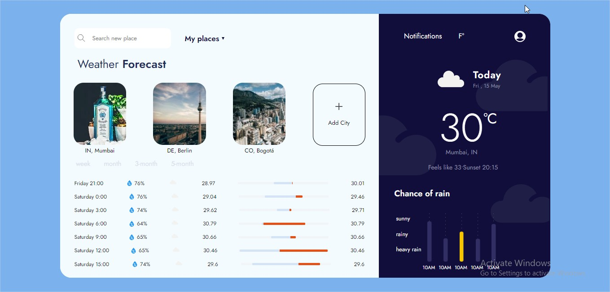

# JavaScript Weather API 
In this project I created a simple weather app. with the following functionallities:
- have multiple weather requests
- Search Over thousands of cities
- fetch imgs for beter UX
- gives probabilites of times and weather days

Thanks to OutCrowd for this beautiful [UI](https://dribbble.com/shots/7177589-Dashboard-Weather-App)

## Built With

- HTML5 
- Sass
- EcmaScript 8
- webpack 3
- npm

- Issue:
The time of getting the data is arround 22s, I will improve this in future times. Any suggestion will be valuable.

## Getting Started

Download or clone the current project, then enter in the project's directory from the terminal and run the following comands:
- `npm i`
- `npm run start`

## Authors

:man: **Nicolás Mariño Parra**

- Github: [@nicolasmarino99](https://github.com/nicolasmarino99)
- Twitter: [@nicolasmarino99](https://twitter.com/nicolasmarino99)
- Linkedin: [Nicolás Mariño Parra](https://www.linkedin.com/in/nicol%C3%A1s-mari%C3%B1o-parra-45a707177/)

## 🤝 Contributing

Contributions, issues and feature requests are welcome!

## Show your support

Give a ⭐️ if you like this project!

